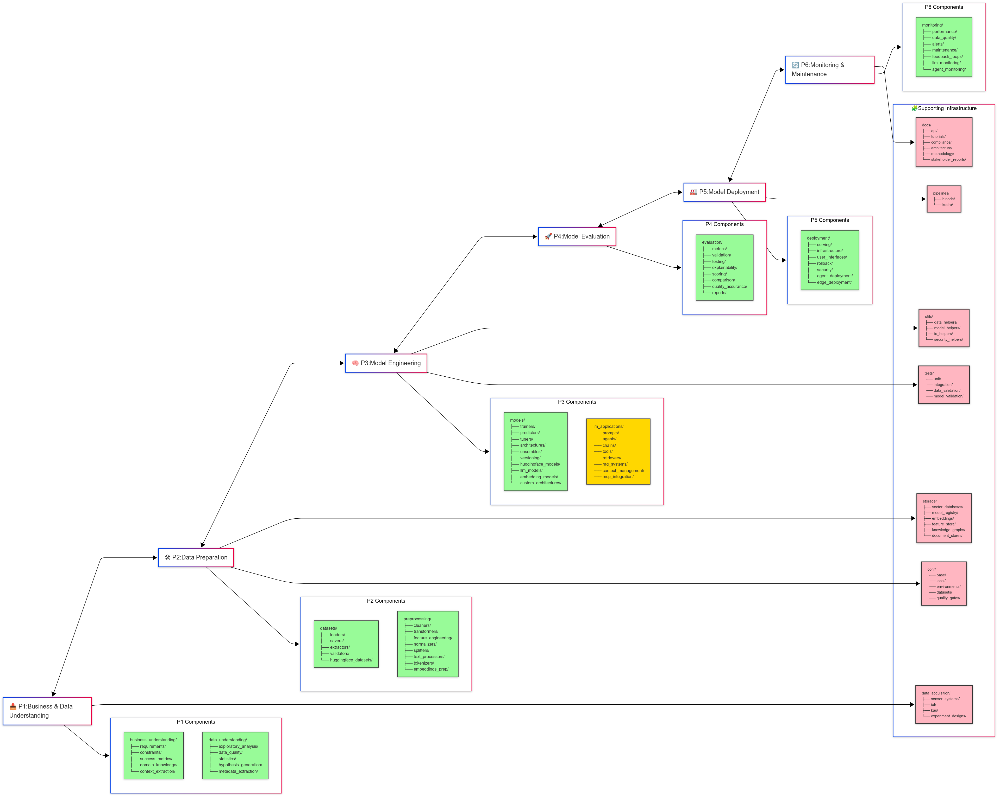

© 2021 nmc-costa. All Rights Reserved. simplifyhit™ is a trademark of nmc-costa.

# 🧬 HITnode 
> **Modular, standards-first node library for ML & GenAI pipelines.**: is a standards-first, modular codebase designed to accelerate ML and GPAI development through reusable, composable nodes. It bridges the gap between innovation and implementation—making intelligent software development simpler, faster, and more sustainable. Build with precision. Scale with purpose. 🚀 #HITnode #CRISPMLQ #ModularAI

<p align="center">

</p>


## 📌 Key Highlights

* **HITnode**
  Human Interface Technology-inspired, yet fully agnostic to any specific framework.

* **Standards-Driven**
  Aligns with CRISP-DM & CRISP-ML(Q) phases, LangChain patterns, Model Context Protocol (MCP) and other standards.

* **Node-Based**
  Build pipelines by snapping together reusable, well-tested nodes (`fit`/`transform`/`predict` interfaces).


---


## 🎯 VISION
- Create agnostic and modular nodes (functions || classes)
- Codebase directory architecture based on standards
- Enable autonomous generation of new projects based on these nodes instead of letting GenAI build everything from scratch
- The nodes will then be used on projects to follow a node-pipeline framework
- **NOTE**: HITnode is designed as a **structural blueprint** to construct a **library of nodes** for projects. To ensure seamless integration and maintain consistency, we strongly recommend that any project adopts the HITnode directory structure within its own `src/` folder. 


## 🔄 Node-Based Architecture

Each directory contains **nodes** - reusable components that can be combined to build ML pipelines. Nodes should follow consistent interfaces/packages/standards for easy composition and testing.

## 🎯 Design Principles

- **Modularity**: Each node has a single responsibility
- **Reusability**: Nodes can be used across different pipelines
- **Clarity**: Directory and file names are self-documenting
- **Scalability**: Easy to add new nodes and extend functionality

## 🛠️ Current Node-Pipeline Frameworks to use this blueprint
- **Native Python framework:**
  - [HICODE](https://github.com/nmc-costa/HIcode/blob/main/)
- **Custom 3rd party Framework:**
  -  [kedro](https://github.com/kedro-org/kedro)

## 📊 Methodology Standards
- **Data Mining**: [CRISP-DM](https://www.datascience-pm.com/crisp-dm-2/)
- **Machine Learning**: [CRISP-ML(Q)](https://ml-ops.org/content/crisp-ml)
- **GPAI Applications**: [🤗HuggingFace](https://huggingface.co/), [LangChain](https://python.langchain.com/docs/concepts/)
- **Model Integration**: [Model Context Protocol (MCP)](https://modelcontextprotocol.io/)


## 📋 RULES

### 🎯 Node Acceptance Criteria
- **Integration**: Coordinators handle integration and merging to main branch
- **Documentation**: Nodes well documented in Jupyter notebooks with usage examples, API documentation, and integration guides
- **Testing**: Node should have tests - unit tests, dummy tests
- **Innovation**: Custom to DSML purposes or solving problems not easily handled by existing packages; 
- **Packages**: Nodes should use standard, trusted and most used packages like scikit-learn, hugging face, pandas, etc; Don't add nodes that use new and untested packages;
- **Performance**: Include benchmarks and performance considerations


### 🔧 Code Standards  
- Follow [scikit-learn](https://scikit-learn.org/stable/developers/develop.html#naming), [ML-Ops](https://ml-ops.org/content/mlops-principles#naming-conventions), [Google ML Style Guide](https://developers.google.com/machine-learning/guides/rules-of-ml), [CRISP-ML(Q)](https://ml-ops.org/content/crisp-ml), [LangChain](https://python.langchain.com/docs/concepts/), and [MCP](https://modelcontextprotocol.io/) naming/code conventions
- Make them as agnostic as possible to versioning: Maintain backward compatibility or provide clear migration paths
- Minimize external dependencies, use the must trusted and used packages
- Implement configuration management through `conf/` directory

### 🚀 Git Workflow
- Create feature branch named after the node: `feature/node-name`
- Require code review before merging to main from other coordinator
- Include performance benchmarks for computationally intensive nodes
- Run automated security scanning and compliance checks
- Map contributions to CRISP-ML(Q) phases


## 🚀 Getting Started
1. **Identify CRISP-ML(Q) Phase**: Determine which phase your node belongs to (Business Understanding → Data Understanding → Data Preparation → Model Engineering → Model Evaluation → Model Deployment → Monitoring & Maintenance)
2. **Choose Application Type**: Determine if you're building traditional ML, LLM applications, RAG systems, AI agents, or multi-modal AI
3. Choose the appropriate directory for your node type based on the phase mapping and application type
4. Follow above the 🔧 Code Standards above.
5. Implement nodes with simple packages [scikit-learn style interfaces](https://scikit-learn.org/stable/developers/develop.html#apis-of-scikit-learn-objects) (`fit`, `transform`, `predict`) and framework-specific patterns (LangChain chains, MCP tools)
6. Set up configuration management in `conf/` directory using python, yaml or JSON and following for example [Kedro patterns](https://docs.kedro.org/en/stable/configuration/configuration_basics.html)
7. Compose nodes into pipelines as needed by copying the directory into `src/`

---

# 📁 Directory Structure

This codebase follows a node-based architecture where each directory contains reusable nodes that can be composed into ML pipelines, organized by **CRISP-ML(Q)** phases with modern AI/LLM integration. 

**NOTE**: 
- **FULL DIRECTORY STRUCTURE**: [full_directory_structure.md](full_directory_structure.md)
- Follows [**Custom CRISP-ML table**](https://github.com/nmc-costa/HITnode/blob/main/full_directory_structure.md#%EF%B8%8F-custom-crisp-ml-table) 
- project packages source code `src/` should follow the directory structure from this codebase.
- If more folders are needed or redifinitions, do so on this structure


```
# 📥 Phase 1: Business & Data Understanding
business_understanding/          # 📋 Business: Domain metadata: Business objectives and requirements processing
├── requirements/               # 🎯 Business: NLP nodes to extract and embed stakeholder requirements
├── constraints/                # ⚠️ Business: Parse technical/business constraints and create constraint graphs
├── success_metrics/            # 📊 Business: Extract and formalize business KPIs and success criteria
├── domain_knowledge/           # 📚 Business: Process domain-specific documents and create knowledge graphs
└── context_extraction/         # 🔍 Business: Extract and structure business context for LLM applications

data_understanding/              # 🔬 Analysis: Data exploration and automated analysis
├── exploratory_analysis/       # 📈 Analysis: Automated EDA with statistical profiling
├── data_quality/               # ✅ Analysis: Data quality assessment and anomaly detection (text, image, audio, video)
├── statistics/                 # 📊 Analysis: Statistical analysis and distribution modeling
├── hypothesis_generation/      # 💡 Analysis: NLP-based hypothesis generation from data insights
└── metadata_extraction/        # 🏷️ Analysis: Automated metadata extraction and cataloging

# 🛠 Phase 2: Data Engineering (Data Preparation)
datasets/                        # 📥 Data I/O: Ingestion, loading, and saving operations
├── loaders/                    # 📂 I/O: Load data from various sources (CSV, JSON, APIs, databases) and modalities
├── savers/                     # 💾 I/O: Save data to different formats and destinations
├── extractors/                 # 🔌 I/O: Extract data from external systems and APIs
├── validators/                 # ✔️ I/O: Data quality validation and schema checking
└── huggingface_datasets/       # 🤗 I/O: Hugging Face dataset integration and management

preprocessing/                   # 🛠️ Data transformations: Cleaning and feature engineering
├── cleaners/                   # 🧹 Transform: Data cleaning and quality improvement nodes
├── transformations/            # 🔄 Transform: Data type conversions and transformations
├── feature_engineering/        # ⚙️ Transform: Feature creation, selection, and extraction
├── normalizers/                # 📏 Transform: Data normalization and scaling
├── splitters/                  # ✂️ Transform: Train/validation/test data splitting
├── text_processors/            # 📝 Transform: Text preprocessing for NLP and LLM applications
├── tokenizers/                 # 🔤 Transform: Tokenization nodes for various models and frameworks
└── embeddings_prep/            # 🎯 Transform: Prepare data for embedding generation

# 🧠 Phase 3: ML Model Engineering
models/                          # 🤖 ML core: Training, fitting, prediction, and inference
├── trainers/                   # 🎓 Training: Model training and fitting nodes
├── predictors/                 # 🔮 Inference: Prediction and inference nodes
├── tuners/                     # 🎛️ Training: Hyperparameter tuning and optimization
├── architectures/              # 🏗️ Training: Model architecture definitions and configurations
├── ensembles/                  # 🤝 Training: Ensemble methods and model combination
├── registry/                   # 📦 Training: Documenting ML model, versioning, experiments metadata
├── huggingface_models/         # 🤗 Training: Hugging Face model integration and fine-tuning
├── llm_models/                 # 🤖 Training: Large language model implementations and wrapper APIs
├── embedding_models/           # 🎯 Training: Embedding model implementations (text, image, multimodal)
└── custom_architectures/       # 🔧 Training: Custom neural network architectures

gpai_applications/                # 🧠 GPAI: Large Models powered applications components (LLMOPs, VLMOPs, Transformers, agents)
├── prompts/                    # 💬 GPAI: Prompt engineering and template management
├── agents/                     # 🤖 GPAI: AI agent implementations and workflows
├── chains/                     # 🔗 GPAI: LangChain-style processing chains
├── tools/                      # 🛠️ GPAI: AI tools and function calling
├── retrievers/                 # 🔍 GPAI: Information retrieval systems
├── rag_systems/                # 📚 GPAI: Retrieval Augmented Generation
├── context_management/         # 🧠 GPAI: Context handling and memory
└── mcp_integration/            # 🔌 GPAI: Model Context Protocol integration

# 🚀 Phase 4: ML Model Evaluation
evaluation/                      # 📊 Assessment: Unified evaluation, metrics, and analysis
├── metrics/                    # 📈 Assessment: Performance metrics (MAE, MSE, F1, AUC, BLEU, ROUGE)
├── validation/                 # ✅ Assessment: Cross-validation and model validation strategies
├── testing/                    # 🧪 Assessment: A/B testing and statistical testing nodes
├── explainability/             # 🔍 Assessment: Model interpretability (SHAP, LIME, feature importance)
├── scoring/                    # 🎯 Assessment: Scoring predictions (thresholds, business rules)
├── comparison/                 # ⚖️ Assessment: Model comparison and benchmarking
├── quality_assurance/          # 🛡️ Assessment: Quality gates and acceptance criteria
└── reports/                    # 📋 Assessment: Representations, plots, demos for different users


# 🏭 Phase 5: Model Deployment 
deployment/                      # 🚀 Production: Deployment and serving
├── serving/                    # 🌐 Production: Packaging, containers, Docker images, serving endpoints
├── infrastructure/             # 🏗️ Production: Infrastructure as code and deployment configs
├── user_interfaces/            # 👥 Production: Developer, partner, end user interfaces, StreamLit labs
├── rollback/                   # ↩️ Production: Rollback and recovery mechanisms
├── security/                   # 🔒 Production: Security configurations and access controls
├── agent_deployment/           # 🤖 Production: AI agent deployment systems
└── edge_deployment/            # 📱 Production: Edge and mobile deployment

# 🔄 Phase 6: Model Monitoring & Maintenance
monitoring/                      # 👁️ Operations: Continuous monitoring and maintenance
├── performance/                # 📊 Operations: Model performance and drift monitoring
├── data_quality/               # ✅ Operations: Ongoing data quality monitoring
├── alerts/                     # 🚨 Operations: Alerting and notification systems
├── maintenance/                # 🔧 Operations: Model maintenance and retraining triggers
├── feedback_loops/             # 🔄 Operations: Feedback collection and incorporation
├── llm_monitoring/             # 🧠 Operations: LLM-specific monitoring (token usage, latency, quality)
└── agent_monitoring/           # 🤖 Operations: AI agent monitoring systems

# 🧩 Supporting Infrastructure
conf/                           # ⚙️ Configuration: Environment settings and configurations
├── base/                      # 🏗️ Config: Base configuration files
├── local/                     # 💻 Config: Local development overrides
├── environments/              # 🌍 Config: Environment-specific configurations
├── datasets/                  # 📋 Config: Data contracts, schemas
└── quality_gates/             # 🛡️ Config: Quality assurance configurations

tests/                          # 🧪 Quality: Comprehensive testing framework
├── unit/                      # 🔬 Testing: Unit tests for individual nodes
├── integration/               # 🔗 Testing: Integration tests for pipelines
├── data_validation/           # ✅ Testing: Data quality and schema validation tests
└── model_validation/          # 🎯 Testing: Model performance and quality tests

data_acquisition/                # 📡 Hardware: Acquisition of data and knowledge
├── sensor_systems/             # 🔌 Hardware: Sensor hardware interfaces, communication, synchronization (ROS2)
├── iot/                        # 📶 Hardware: IoT communication and messaging (MQTT, brokers)
├── kas/                        # 🧠 Hardware: Knowledge acquisition systems (ontologies, expert systems)
└── experiment_designs/         # 🔬 Hardware: Design-of-experiments for algorithm comparisons, A/B tests

pipelines/                       # 🔄 Orchestration: Automated deployment pipelines (node-pipeline frameworks)
├── hinode/                     # 🎯 Orchestration: HITnode framework pipelines (with README.md for usage)
└── kedro/                      # 🔧 Orchestration: Kedro framework pipelines (with README.md for usage)

storage/                        # 💾 Data persistence: All storage operations (RAG, vector DBs, model storage)
├── data/                      # 🧪 Dev/Test: Locally temporary data folder that serves sample subsets to validate nodes
├── vector_databases/          # 🔍 Prod: Vector database operations for embeddings and semantic search
├── model_registry/            # 📦 Prod: Model store versioning, storage, and retrieval
├── embeddings/                # 🎯 Prod: Store and retrieve embeddings for RAG applications
├── feature_store/             # 📊 Prod: Feature store management and serving
├── knowledge_graphs/          # 🕸️ Prod: Graph databases for constraints, relationships, domain knowledge
└── document_stores/           # 📄 Prod: Document storage for RAG and knowledge systems

utils/                          # 🔧 Utilities: Common utilities and helper functions
├── data_helpers/              # 📊 Utilities: Data manipulation and processing utilities
├── model_helpers/             # 🤖 Utilities: Model-related utility functions
├── io_helpers/                # 📁 Utilities: Input/output operation helpers
└── security_helpers/          # 🔒 Utilities: Security and encryption utilities

docs/                           # 📚 Documentation: Documentation and compliance records
├── api/                       # 🔌 Docs: API documentation
├── tutorials/                 # 📖 Docs: Usage examples and tutorials
├── compliance/                # 📋 Docs: Regulatory compliance documentation
├── architecture/              # 🏗️ Docs: System architecture documentation
├── methodology/               # 📐 Docs: Methodology process documentation
└── stakeholder_reports/       # 👥 Docs: Reports for business stakeholders
```

<!--
### Emoji Categorization: 
**Each directory is clearly marked with emojis indicating its purpose:**
  ```
  🧪 Dev/Test: Development and testing components
  🚀 Prod: Production systems and operations
  📋 Business: Business logic and requirements
  🔬 Analysis: Data analysis and exploration
  📥 I/O: Input/output operations
  🛠️ Transform: Data transformation and processing
  🤖 Training: Model training and development
  🌟 GenAI: Generative AI and LLM components
  📊 Assessment: Evaluation and metrics
  🌐 Production: Production deployment
  👁️ Operations: Monitoring and maintenance
  💾 Data: Data storage and persistence
  📡 Hardware: Hardware interfaces and acquisition
  🔄 Orchestration: Pipeline orchestration
  🔧 Utilities: Helper functions and utilities
  ⚙️ Config: Configuration management
  🧪 Testing: Quality assurance and testing
  📚 Docs: Documentation and compliance
  ```
-->
---

# 📋 Diagrams

### Base diagram
<p align="center">

</p>

### GPAI components example (using LLMs)
<p align="center">

</p
  
---


# Sponsorship

We value the support of our community in advancing simple human interface technologies. If you believe in the mission of simplifyhit™ and would like to contribute to its development and maintenance, consider becoming a sponsor or contact us for custom services. Your support enables us to enhance the codebase, expand our resources, and provide ongoing support to the community. 

- **Contact Services**: For custom simplifyhit™ in your business, [linkedin](linkedin.com/in/nuno-m-c-da-costa-a14a4349).

- **GitHub Sponsors**: Support simplifyhit™ projects through GitHub Sponsors and help us maintain its quality and accessibility. Visit our [GitHub Sponsors](https://github.com/sponsors/simplifyhit) page to explore sponsorship options. 

- **Patreon**: Show your commitment by becoming a patron on [Patreon](https://www.patreon.com/simplifyhit).

- **Open Collective**: Contribute to simplifyhit™ sustainability by sponsoring us on [Open Collective](https://opencollective.com/simplifyhit). Your donations help us cover project-related expenses and support ongoing improvements.


Your sponsorship not only assists in driving the development of simplifyhit™ projects but also ensures their availability as free and open-source resources for the wider community. We are immensely grateful for your support!

## License

The project is released under the [MIT License](https://opensource.org/licenses/MIT), granting you the freedom to use, modify, and distribute the codebase while providing attribution to the original authors.

Let's revolutionize data science and engineering collaboration! Together, we build a stronger foundation for the future of software development. Happy coding!

*Please note: The HIcode repository is maintained and updated to incorporate emerging best practices and advancements. Be sure to check back for the latest improvements.*


### 📋 GitHub Topics

```
machine-learning  crisp-ml-q  nodes  pipeline  langchain  mlops  hitnode
```
